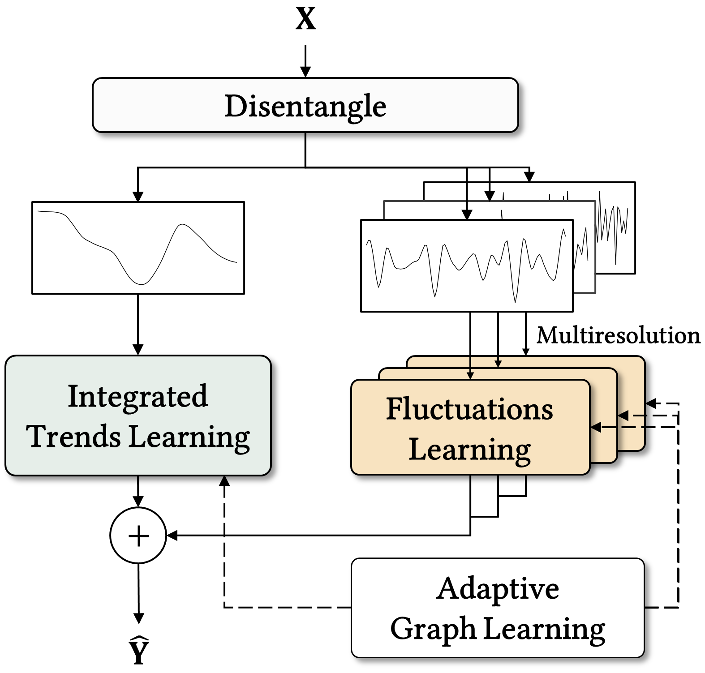
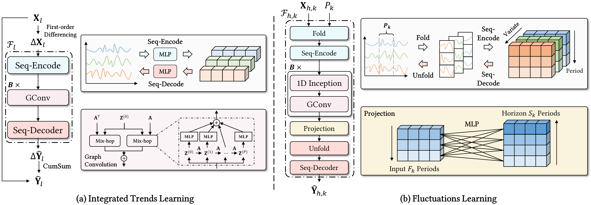
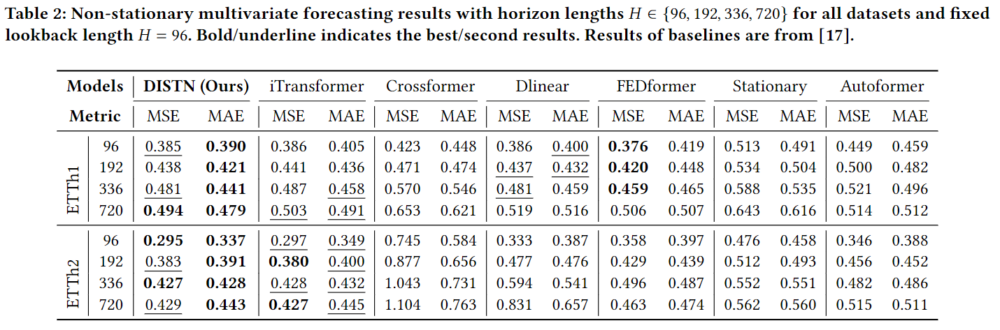

# DISTN
This repo is the official implementation for the paper: Disentangled Integrated Spatio-Temporal Network for Non-Stationary Multivariate Time Series Forecasting

## Model Framework

<p align="center">

<br><br>
<b>Figure 1.</b> Overall structure of DISTN.
</p>

|                                                                                 |
|:----------------------------------------------------------------------------------------------------:|
| *Figure 2. Detailed structures of the integrated trends learning and fluctuations learning modules.* |

## Main Results



## Get Started
1. Install Pytorch and necessary dependencies.
```
pip install -r requirements.txt
```

2. Train and evaluate the model
- DISTN model as illustrated in methodology section
```
python run_DISTN.py --seed 2024 --dataset ETTh2 --itr 1
```

- Disentangled integrated framework with general forecasting backbone model
```
python run_DIN.py --seed 2024 --dataset ETTh2 --backbone iTransformer --itr 1
```

## Acknowledgement

We appreciate the following github repos a lot for their valuable code base or datasets:

https://github.com/thuml/Autoformer

https://github.com/zhouhaoyi/Informer2020

https://github.com/thuml/iTransformer

https://github.com/thuml/Time-Series-Library